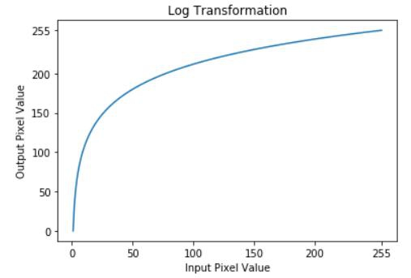

# 图像运算与图像增强

## 一. 图像灰度化

| 方法/实现 | 计算公式 | 特点 |
| :--- | :--- | :--- |
| **分量法** | `Gray = R`（或G、B） | 极简，丢弃2/3色彩信息 |
| **最大值法** | `Gray = max(R, G, B)` | 亮度偏高，对比度弱 |
| **平均值法** | `Gray = (R + G + B) / 3` | 未考虑人眼敏感度，偏暗 |
| **加权平均法（浮点）** | `Gray = 0.299*R + 0.587*G + 0.114*B` | **最符合人眼视觉**，效果自然 |
| **加权平均法（整数）** | `Gray = (299*R + 587*G + 114*B) / 1000` | 速度与精度的**最佳平衡** |
| **加权平均法（移位）** | `Gray = (77*R + 150*G + 29*B) >> 8` （或`19595*R+38469*G+7472*B >> 16`） | **最快**，完全避免乘除与浮点 |

## 二. 图像灰度变换

### 2.1 核心定义

灰度变换是指**根据某种目标条件，按一定变换关系逐点改变源图像中每一个像素灰度值**的方法。

其数学表达式为：

`g(x, y) = T[f(x, y)]`

其中，`f(x, y)`是原始像素灰度值，`g(x, y)`是变换后的灰度值，`T`是灰度变换函数。

**核心目的**：改善画质，解决因成像系统限制或光照不足导致的**对比度不足、动态范围狭窄**问题，使图像更清晰、细节更易识别。

---

| 分类 | 变换函数特点 | 典型方法 | 适用场景 |
| :--- | :--- | :--- | :--- |
| **线性变换** | `T`为线性函数，灰度值按固定比例整体拉伸或压缩 | 全局线性拉伸、亮度调整（加常数） | 图像整体曝光不足或过度，需要全局调整对比度时 |
| **分段线性变换** | `T`为分段线性函数，不同灰度区间采用不同斜率 | 对比度拉伸（三段线性变换） | 需要突出特定灰度区间（如病变组织），抑制其他区间时|
| **非线性变换** | `T`为非线性函数（对数、幂次等），对不同灰度区域进行非均匀增强 | 对数变换、伽马变换（幂次变换）、指数变换 | 图像暗部或亮部细节不足，需针对性增强时|

### 2. 各类变换详解

以下各公式中,`s`为输出图像灰度值，`r`为输入图像灰度值

#### 2.1 线性变换

**公式**：`s = a * r + b`

- `a`控制对比度（斜率）：`a > 1`拉伸对比度；`0 < a < 1`压缩对比度；`a < 0`实现灰度反转（负片效果）。
- `b`控制整体亮度（截距）：`b > 0`增亮；`b < 0`减暗。  

**PS**：a=-1,b=255时可以实现原始图像的灰度值反转。  

**典型应用**：若原始图像灰度集中在`[a, b]`区间，通过线性映射将其扩展至`[c, d]`（`c < a, d > b`），即可有效提升对比度。

#### 2.2 分段线性变换

**特点**：不同灰度区间采用不同的线性映射，可以“选择性增强”。

**典型应用**：三段线性变换——将感兴趣的目标灰度区间`[a, b]`拉伸至`[c, d]`（斜率>1），同时压缩或保持不变的低灰度区`[0, a]`和高灰度区`[b, L-1]`。常用于医学影像中突出病灶区域。

### 2.3 非线性变换

当图像暗部或亮部细节不足时，线性变换难以兼顾，此时需使用非线性变换。

#### (1) 对数变换

**公式**：`s = c * log(1 + r)`

**作用**：**扩展低灰度值（暗部）范围，压缩高灰度值（亮部）范围**，使图像灰度分布更均匀，匹配人眼视觉特性。



**适用场景**：灰度范围极大的图像，如傅里叶频谱图。

#### (2) 伽马变换（幂次变换）

**公式**：`s = c * r^γ`

**作用**：

- `γ < 1`：**增强暗部细节，压缩亮部细节**（类似对数变换效果）
- `γ > 1`：**增强亮部细节，压缩暗部细节**
- `γ = 1`：退化为线性变换

**适用场景**：校正显示设备非线性响应、调整图像整体亮度感知。

- **直方图均衡化**：通过重新分布灰度级，使图像对比度达到最大化。
- **灰度阈值/灰度级分割**：将灰度划分为若干区间，每个区间映射为单一灰度值，用于突出特定区域（如热红外温度分层）。

## 三. 灰度阈值化

### 1. 灰度阈值化概念

灰度阈值化是最简单的图像分割方法。它利用图像中目标与背景在灰度上的差异，**选取一个阈值 `T`**，将像素划分为两类（或通过多阈值划分为多类），从而将目标区域从背景中分离出来。

### 2. 灰度阈值化-cv2.threshold()

```python
[retval,] dst = cv2.threshold(src, thresh, maxval, type[,dst])
```

- `src`：输入图像（通常为灰度图，单通道）。

- `retval`：自适应阈值化时计算出的阈值,非自适应阈值化方法可以省略

- `dst`：输出图像

- `thresh`：设定的阈值（浮点数）。

- `maxval`：当像素满足特定条件时赋予的最大值（通常为255）。

- `type`：阈值化方法的类型，决定如何处理像素值与阈值的关系。

| 方法名称 | 类型常量 | 数值 | 算法含义 |
| :--- | :--- | :---: | :--- |
| 二值化阈值 | `cv2.THRESH_BINARY` | 0 | 像素值 **大于** 阈值 `thresh` 时，置为 `maxval`（通常255）；**小于等于** 阈值时，置为 0。输出为纯黑白二值图。 |
| 反二值化阈值 | `cv2.THRESH_BINARY_INV` | 1 | 与 `BINARY` 完全相反。像素值 **大于** 阈值时，置为 0；**小于等于** 阈值时，置为 `maxval`。输出为纯黑白二值图。 |
| 截断阈值 | `cv2.THRESH_TRUNC` | 2 | 像素值 **大于** 阈值时，被**截断**并固定为阈值 `thresh` 本身；**小于等于** 阈值时，保持不变。**输出仍为灰度图**。 |
| 零阈值 | `cv2.THRESH_TOZERO` | 3 | 像素值 **大于** 阈值时，**保持不变**；**小于等于** 阈值时，被置为 0。**输出仍为灰度图**。 |
| 反零阈值 | `cv2.THRESH_TOZERO_INV` | 4 | 与 `TOZERO` 相反。像素值 **大于** 阈值时，被置为 0；**小于等于** 阈值时，**保持不变**。**输出仍为灰度图**。 |
| Otsu 自动阈值 | `cv2.THRESH_OTSU` | 8 | **自动计算**最佳阈值，无需人工设定。算法通过**最大化类间方差**来确定阈值，适用于直方图呈**双峰分布**的图像。**必须与 `BINARY` 或 `BINARY_INV` 组合使用**。 |
| 三角形自动阈值 | `cv2.THRESH_TRIANGLE` | 16 | **自动计算**最佳阈值，无需人工设定。算法基于灰度直方图的**三角形几何原理**，适用于直方图呈**单峰或偏态分布**的图像。**必须与 `BINARY` 或 `BINARY_INV` 组合使用**。 |
| 掩码标志 | `cv2.THRESH_MASK` | 7 | OpenCV **内部使用**的掩码标志，用于位运算提取阈值类型。**一般用户不直接使用**。 |

### 3. 组合标志使用方法

Otsu 自动阈值`THRESH_OTSU` 和 三角形自动阈值`THRESH_TRIANGLE` 不能单独使用，必须与二值化阈值 `THRESH_BINARY` 或 反二值化阈值`THRESH_BINARY_INV` 通过加法或位或运算组合：

```python
# 正确用法
ret, dst = cv2.threshold(src, 0, 255, cv2.THRESH_BINARY + cv2.THRESH_OTSU)
ret, dst = cv2.threshold(src, 0, 255, cv2.THRESH_BINARY | cv2.THRESH_OTSU)

# 也支持与 BINARY_INV 组合
ret, dst = cv2.threshold(src, 0, 255, cv2.THRESH_BINARY_INV + cv2.THRESH_TRIANGLE)
```

## 四. 自适应图像阈值化

### 1. 自适应图像阈值化概念

在 OpenCV 中，`cv2.adaptiveThreshold()` 是专门用于自适应阈值化的函数。与全局阈值化不同，它会为图像中的**每一个像素**单独计算阈值，从而有效应对**光照不均匀**或**背景渐变**等复杂情况。

### 2. 自适应图像阈值化-cv2.adaptiveThreshold()

其函数原型为：

```python
dst = cv2.adaptiveThreshold(src, maxValue, adaptiveMethod, thresholdType, blockSize, C[,dst])
```

- `src`：输入图像，需为8位单通道灰度图。

- `maxValue`：满足条件时赋予像素的最大值，通常为255。

- `adaptiveMethod`：自适应方法，决定如何计算局部阈值。这是核心参数之一。

| 参数常量 | 数值 | 算法原理 | 计算公式 | 特点 | 适用场景 |
| :--- | :---: | :--- | :--- | :--- | :--- |
| `cv2.ADAPTIVE_THRESH_MEAN_C` | 0 | **均值法**。计算像素 `(x, y)` 周围 `blockSize × blockSize` 邻域内所有像素的**算术平均值**，再减去常数 `C` 作为该像素的局部阈值。 | `T(x, y) = mean(邻域窗口) - C` | 计算速度快，对噪声较敏感，边缘较为锐利。 | 图像噪声较少、光照变化平缓的场景。 |
| `cv2.ADAPTIVE_THRESH_GAUSSIAN_C` | 1 | **高斯加权法**。计算像素 `(x, y)` 周围 `blockSize × blockSize` 邻域内所有像素的**高斯加权和**（距离中心越近权重越大），再减去常数 `C` 作为局部阈值。 | `T(x, y) = weighted_sum_高斯(邻域窗口) - C` | 抗噪性强，阈值过渡更平滑，能更好地保留纹理细节，但计算量稍大。 | 图像噪声较多、纹理丰富或需要精细分割的场景。 |

- `thresholdType`：阈值类型，只能是 THRESH_BINARY 或 THRESH_BINARY_INV。

- `blockSize`：邻域大小，用于计算阈值的像素窗口尺寸，通常为3、5、7等奇数。`blockSize` 越大，阈值受更大范围背景影响，对局部细节变化越不敏感，结果更平滑；`blockSize` 越小，阈值越能跟随细微的纹理变化，但也可能放大噪声。

- `C`：常数修正值，从计算出的平均值或加权平均值中减去的常数，可以为正、零或负。用于微调阈值的敏感度。值越大，T(x, y) 越小，更多像素会被判定为前景（变白）；值越小（负值），T(x, y) 越大，更多像素会被判定为背景（变黑）。

## 五. 形态学处理

### 1.形态学理论

形态学处理（Morphological Processing）是数字图像处理中基于**数学形态学**理论的一类技术。它主要针对**二值图像**（也可扩展到灰度图像），通过使用一个称为**结构元素（Structuring Element）**的小模板在图像上滑动，来探测和提取图像的形状、结构特征。

其核心思想是：**用结构元素去“探测”图像，看它能否被该结构元素“击中”或“击中”，从而改变图像的形状。**

### 2. 形态学处理的两大基本运算

所有复杂的形态学操作，都建立在以下两种基本运算的组合之上。

| 基本运算 | 数学定义 | 直观效果 | 作用 |
| :--- | :--- | :--- | :--- |
| **腐蚀（Erosion）** | 结构元素完全位于前景区域内时，中心点才被保留。 | 前景区域的**边界向内收缩**，细小的连接断开，小物体消失。 | **消除细小物体**、分离黏连目标、去除毛刺。 |
| **膨胀（Dilation）** | 结构元素只要接触到前景区域，中心点就被置为前景。 | 前景区域的**边界向外扩展**，孔洞被填充，细小的断裂被连接。 | **填补前景中的空洞**、连接邻近目标、恢复因腐蚀丢失的边界。 |

---

```python
#腐蚀运算
eroded_img = cv2.erode(src, kernel, iterations=1)
#膨胀运算
dilated_img = cv2.dilate(src, kernel, iterations=1)
```

`src`: 输入图像（通常为二值图）。

`kernel`: 定义腐蚀/膨胀程度的结构元素，即卷积核。

`iterations`: 迭代次数，值越大，腐蚀/膨胀效果越强。默认为一。

### 3. 由基本运算组合而成的常用操作

在实际工程中，腐蚀和膨胀通常组合使用，以实现更复杂的形态学效果。

| 操作 | 组合方式 | 直观效果 | 典型应用 |
| :--- | :--- | :--- | :--- |
| **开运算（Opening）** | **先腐蚀，后膨胀**。 | 平滑物体轮廓，消除细小突出物，断开狭小的连接。 | 去除图像中的细小噪点、分离黏连的细胞或字符。 |
| **闭运算（Closing）** | **先膨胀，后腐蚀**。 | 平滑物体轮廓，填充前景中的细小孔洞，连接邻近的物体。 | 填充目标内部的空洞、连接断开的笔画或边缘。 |
| **形态学梯度（Gradient）** | **膨胀图 - 腐蚀图**。 | 突出物体的**边缘轮廓**。 | 边缘检测、物体轮廓提取。 |
| **顶帽运算（Top Hat）** | **原图 - 开运算结果**。 | 提取出图像中**比周围更亮**的细小物体或细节。 | 提取亮背景上的暗纹理、不均匀光照下的目标增强。 |
| **黑帽运算（Black Hat）** | **闭运算结果 - 原图**。 | 提取出图像中**比周围更暗**的细小物体或细节。 | 提取暗背景上的亮纹理、检测缺陷或孔洞。 |

```python
#高级形态学运算
result = cv2.morphologyEx(src, op, kernel)
```

`src`: 输入图像（通常为二值图）。

`kernel`: 定义腐蚀/膨胀程度的结构元素，即卷积核。

`iterations`: 迭代次数，值越大，效果越强。默认为一。

`op`:处理方式。

- `cv2.MORPH_OPEN`:开运算：先腐蚀，后膨胀。

- `cv2.MORPH_CLOSE`:闭运算：先膨胀，后腐蚀。

- `cv2.MORPH_GRADIENT`:形态学梯度：膨胀结果减去腐蚀结果。

- `cv2.MORPH_TOPHAT`:顶帽运算：原图减去开运算结果。

- `cv2.MORPH_BLACKHAT`:黑帽运算：闭运算结果减去原图。

## 六. 图像直方图

### 1. 图像直方图基础

图像直方图是一种统计图表，用来描述图像中不同灰度值（或颜色值）的像素出现的频率。

- 横轴：代表像素的灰度级。对于8位灰度图，范围是0到255。0表示纯黑，255表示纯白。

- 纵轴：代表在该灰度级下的像素数量，或者像素数量占总像素数的比例。

### 2. 直方图归一化

归一化的本质是对原始直方图进行“缩放”，使其所有值的总和等于1（或100%）。这样，每个灰度级对应的值就可以被解释为该灰度级在图像中出现的**概率**。

**计算公式**：
对于图像中的第 `k` 个灰度级，其归一化后的值为：

`p(r_k) = n_k / N`

- `n_k`：灰度值为 `r_k` 的像素个数（原始直方图的值）。
- `N`：图像的总像素数（`N = 宽度 × 高度`）。
- `p(r_k)`：归一化后该灰度级出现的**概率**。

**结果特点**：

- `0 ≤ p(r_k) ≤ 1`（值域在0到1之间）。
- `Σ p(r_k) = 1`（所有灰度级概率之和为1）。

> 公式中的 `p(r_k)` 在数学上被称为**概率密度函数（PDF）**的离散估计，它描述了图像中灰度值的分布规律。

### 3. 直方图的绘制

#### 3.1 **OpenCV绘制**-cv2.calcHist() + matplotlib.pyplot.plot()

```python
hist=cv2.calcHist(images, channels, mask, histSize, ranges, hist=None, accumulate=False)#获取直方图数据
plt.plot(hist, color)#绘制直方图
```

| 参数 | 类型 | 含义 | 在图像直方图中的典型用法 |
| :--- | :--- | :--- | :--- |
| `images` | 图像列表 `[src]` | 输入图像，必须用方括号 `[]` 括起来。支持多图像同时计算。 | `[img]`，其中 `img` 是 OpenCV 读取的图像（numpy 数组）。 |
| `channels` | 整数列表 `[ch]` | 需要计算的通道索引。对于灰度图是 `[0]`；对于彩色图，`[0]`=B，`[1]`=G，`[2]`=R。 | 灰度图：`[0]`；彩色图的 B 通道：`[0]`；多通道同时计算：`[0, 1, 2]` 会返回多个直方图。 |
| `mask` | numpy 数组 或 `None` | 掩膜图像。与 `images` 同尺寸，非零区域才参与统计。`None` 表示全图计算。 | 通常设为 `None`。若需要只统计 ROI（感兴趣区域），可传入一个二值掩膜。 |
| `histSize` | 整数列表 `[size]` | 直方图的柱子（bins）数量。灰度图常用 `[256]`，表示 0~255 共 256 个区间。 | 若想降低精度，可用 `[128]`、`[64]`。列表长度必须与 `channels` 长度一致。 |
| `ranges` | 列表 `[min, max]` | 像素值范围。通常为 `[0, 256]`（注意不是 `[0, 255]`，因为上限开区间）。 | 固定为 `[0, 256]`。若只想统计暗部 `[0, 128]`，可设为 `[0, 128]`。 |
| `hist` | 数组 或 `None` | 输出直方图数组。如果传入已有数组，结果会写入其中。 | 通常忽略，由函数自动创建并返回。 |
| `accumulate` | bool | 累加标志。若为 `True`，新直方图会累加到 `hist` 上而不重置。 | 极少使用，保持默认 `False`。 |

#### 3.2 **matplotlib绘制**-matplotlib.pyplot.hist()

```python
n, bins, patches = plt.hist(arr, bins,normed, range=(0, 256),color='blue', alpha=0.7)
```

| 参数 | 类型 | 默认值 | 含义 | 在图像直方图中的典型用法 |
| :--- | :--- | :--- | :--- | :--- |
| `arr` | array-like | **必填** | **输入数据**。必须是一维数组或列表。 | 使用 `img.ravel()` 将灰度图展平为一维数组。 |
| `bins` | int / sequence / str | `10` | **柱子数量或区间边界**。决定直方图的精细程度。 | 通常设为 `256`（每个灰度级一个柱子），或 `64`（快速预览趋势）。 |
| `range` | tuple (min, max) | `None` | **统计范围**。只统计 `[min, max]` 区间内的数据。 | 设为 `(0, 256)` 表示统计全部像素值区间。 |
| `density` | bool | `False` | **是否归一化为概率密度**。若为 `True`，纵轴变为概率密度，柱状图面积之和为 1。 | 设为 `True` 可以查看概率分布（归一化直方图）。 |
| `cumulative` | bool | `False` | **是否绘制累积分布**。为 `True` 时绘制 CDF（累积分布函数）。 | 设为 `True` 可以直观显示像素值的累积比例。 |
| `histtype` | `'bar'` / `'barstacked'` / `'step'` / `'stepfilled'` | `'bar'` | **直方图样式**。`'bar'` 为条形图；`'step'` 只画轮廓线，适合多组数据叠加对比。 | 绘制多通道直方图时，可用 `'step'` 避免柱子重叠遮挡。 |
| `align` | `'left'` / `'mid'` / `'right'` | `'mid'` | 柱子对齐方式。`'mid'` 表示柱子中心对齐区间中点。 | 通常保持默认 `'mid'`。 |
| `orientation` | `'vertical'` / `'horizontal'` | `'vertical'` | 绘制方向，纵向或横向。 | 默认纵向即可。 |
| `color` | 颜色值 | `None` | 柱子的填充颜色。 | 如 `'blue'`、`'#ff0000'`。绘制多通道时可分别设置。 |
| `label` | str | `None` | 图例标签，用于 `plt.legend()` 显示。 | 用于区分不同通道或不同图像的曲线。 |
| `log` | bool | `False` | **是否使用对数纵轴**。设为 `True` 时纵轴取对数，可压缩高频值，凸显低频细节。 | 当图像某些灰度级像素极多而其他极少时（如纯色背景），用对数纵轴可同时看清高低频区域。 |
| `stacked` | bool | `False` | 是否将多组数据**堆叠**显示（而非并排）。 | 较少用于图像直方图，通常保持默认 `False`。 |
| `edgecolor` | 颜色值 | `None` | 柱子边框的颜色。 | 如 `edgecolor='black'` 可使柱子边框更清晰。 |
| `linewidth` | float | `0` | 柱子边框线宽。 | 配合 `edgecolor` 使用。 |

### 4. 直方图均衡化

#### 4.1 为什么要均衡化？

在对比度较低的图像（如光照不足或过曝）中，像素灰度值通常集中在一个狭窄的范围内。这导致图像看起来“灰蒙蒙的”，细节不清晰。

**均衡化的目标**：通过一个变换函数，将原本集中分布的灰度值“拉伸”到整个灰度范围（0~255），使每个灰度级上的像素数量尽可能接近相等，从而最大化图像的动态范围。

#### 4.2 数学原理（核心公式）

均衡化基于**累积分布函数（CDF）**。对于灰度级为 \( k \) 的像素，其映射关系为：

\[
$s_k = T(r_k) = (L - 1) \cdot \sum_{j=0}^{k} \frac{n_j}{N}$
\]

| 符号 | 含义 | 说明 |
| :--- | :--- | :--- |
| \( $r_k$ \) | 原始图像的第 \( k \) 个灰度级 | 取值范围 0~255 |
| \( $s_k$ \) | 变换后的新灰度值 | 映射后的输出值 |
| \( $L$ \) | 灰度级总数 | 对于8位图像，\( $L$ = 256 \) |
| \( $n_j$ \) | 灰度级为 \( j \) 的像素个数 | 直方图统计值 |
| \( $N$ \) | 图像总像素数 | \( $N$ = 宽度 \times 高度 \) |
| \( $sum_{j=0}^{k} \frac{n_j}{N}$ \) | **累积分布函数（CDF）** | 表示灰度值 ≤ \( k \) 的像素占总像素的比例 |

> **核心思想**：将原始的灰度值 \( $r_k$ \) 映射为 \( $L-1$ \) 乘以该灰度级之前的累积概率，从而将像素分布“拉开”。

#### 4.3 直方图均衡化-cv2.equalizeHist()

```python
dst = cv2.equalizeHist(src)
```

*PS*：彩色图片中需要对BGR每个分量做均衡化处理后合并。

### 5. 局部直方图均衡化AHE

#### 5.1 局部直方图均衡化

全局直方图均衡化虽然简单高效，但它是一个“一刀切”的全局操作，容易让图像某些部分变得不自然，或放大噪声。**局部直方图均衡化**为每个像素点根据其周围一个小邻域的灰度分布，来计算一个单独的变换函数，从而增强不同区域的细节。

#### 5.2 图像对比度受限的局部直方图均衡化-cv2.createCLAHE()

```python
import cv2

# 读取灰度图
img = cv2.imread('your_image.jpg', 0)

# 创建 CLAHE 对象
# clipLimit: 对比度限制阈值，值越大对比度越强，但噪声也可能增加
# tileGridSize: 将图像划分成的小块大小（如 (8,8) 表示 8x8 的网格）
clahe = cv2.createCLAHE(clipLimit=2.0, tileGridSize=(8,8))

# 应用 CLAHE
result = clahe.apply(img)

cv2.imshow('CLAHE Result', result)
cv2.waitKey(0)
```

| 参数 | 类型 | 默认值 | 取值范围 | 作用简述 |
| :--- | :--- | :--- | :--- | :--- |
| `clipLimit` | 浮点数 | 2.0 | 0.0 ~ 10.0+ | 控制对比度增强的上限，限制直方图尖峰的高度 |
| `tileGridSize` | 整数元组 (h, w) | (8, 8) | (1,1) ~ (图像尺寸) | 控制分块密度，决定局部适应性的精细程度 |

`clipLimit` 是 OpenCV 中 createCLAHE() 函数的核心参数，它的核心作用是 限制局部直方图的高度（即限制对比度增强的最大幅度） ，从而防止噪声被过度放大。你可以把它理解为一个“安全阀”。

在 OpenCV 中，clipLimit 是一个浮点数，其实际裁剪上限的计算公式为：

```python
实际裁剪上限 = clipLimit × (小块总像素数 / 灰度级总数)
```

例如，对于 tileGridSize=(8,8)、clipLimit=2.0 的小块，若小块尺寸为 16×16（即 256 像素），灰度级为 256，则：
实际裁剪上限 = 2.0 × (256 / 256) = 2.0

这意味着该小块中每个灰度级最多允许 2 个像素，超出部分将被裁剪。被裁剪部分将均分到其他区域。

### 6. 自动色彩均衡化

#### 6.1 算法起源与设计灵感

ACE 算法基于 Retinex 理论发展而来，其核心思想是模拟**人眼侧抑制机制**。

#### 6.2 侧抑制机制（Lateral Inhibition）

侧抑制是生理学概念，指某个神经元受到刺激产生兴奋时，邻近神经元对其产生的抑制作用。在图像处理中的映射：

- 图像中某个像素点的最终亮度，不仅取决于其自身值，还受到周围像素的**抑制性影响**
- 距离越近的像素，抑制作用越强（权重越大）
- 这种机制解释了为什么人眼对边缘和对比度敏感，且能在不同光照下识别颜色

ACE 算法正是通过数学建模，将这种生物机制转化为图像增强的计算方法。

---

#### 6.3. ACE 算法的两阶段流程

ACE 算法分为**色彩/空域调整**和**动态范围扩展**两个核心阶段。

##### 6.3.1 阶段一：色差校正（区域自适应滤波）

对单通道图像中所有像素点进行区域自适应滤波，得到空域重构后的中间结果：

\[
$R_c(p) = \sum_{j \in S, j \neq p} \frac{ S_\alpha ( I_c(p) - I_c(j) ) }{ d(p, j) }$
\]

| 符号 | 含义 | 说明 |
| :--- | :--- | :--- |
| \( $I_c(p)$ \) | 像素点 \( $p$ \) 在通道 \( $c$ \) 上的灰度值 | 处理对象为单通道 |
| \( $I_c(j)$ \) | 像素点 \( $j$ \) 在通道 \( $c$ \) 上的灰度值 | 周围像素点 |
| \( $I_c(p) - I_c(j)$ \) | 两点间的灰度差值 | 模拟生物学上的侧抑制效应 |
| \( $S_\alpha(x) $\) | 亮度表现函数（奇函数） | 控制对比度增强的程度和方向 |
| \( $d(p, j)$ \) | 距离度量函数（通常为欧氏距离） | 控制点 \( $j$ \) 对 \( $p$ \) 的影响权重，距离越近权重越大 |
| \( $S$ \) | 采样邻域集合 | 参与计算的周围像素集合 |

> **物理含义**：每个像素的校正值，是周围所有像素与其亮度差值的加权总和——差值越大、距离越近，贡献越大。

##### 6.3.2 亮度表现函数 \( $S_\alpha(x)$ \)

\( $S_\alpha(x)$ \) 是 ACE 算法中控制对比度增强程度的核心函数：

\[
$S_\alpha(x) = 
\begin{cases}
1, & x < -\alpha \\
x / \alpha, & -\alpha \leq x \leq \alpha \\
-1, & x > \alpha
\end{cases}$
\]

| \( $\alpha$ \) 值 | 效果 | 说明 |
| :--- | :--- | :--- |
| **小 \( $\alpha$ \)** | 对比度增强更强烈 | 函数快速进入饱和区，微小差异被放大 |
| **大 \( $\alpha $\)** | 对比度增强更平缓 | 线性区域更宽，增强更温和 |
| **极限情况** | Sign 函数（无差别放大） | 会导致噪声被同等放大，效果不佳 |

> **推荐**：选择 Saturation 函数而非 Sign 函数，可以在增强对比度的同时避免噪声过度放大。

##### 6.3.3 阶段二：动态范围扩展（色调重整）

将第一阶段得到的中间量 \($ R_c(p)$ \) 映射到完整的灰度范围 [0, 255]：

\[
$L(x) = \frac{R(x) - \min R}{\max R - \min R}$
\]

- 将全部像素的 \( R \) 值线性拉伸到 [0, 1] 区间
- 再乘以 255 得到 8 位灰度值
- 这一步骤实现了图像的**全局白平衡**和**动态范围最大化**

##### 6.3.4 彩色图像的扩展

对于彩色图像，将 RGB 三个通道**分别独立处理**，再将三个通道的处理结果合并：

```python
def zmIceColor(I, ratio=4, radius=3):
    res = np.zeros(I.shape)
    for k in range(3):  # 分别处理 R、G、B 三个通道
        res[:, :, k] = stretchImage(zmIceFast(I[:, :, k], ratio, radius))
    return res
```

## 七. 图像平滑

图像平滑（Image Smoothing），也称为图像模糊（Image Blurring）或图像滤波，是图像处理中最基础、最常用的操作之一。它的核心目的是**抑制图像中的噪声，减少图像中的细节和纹理，使图像变得更加平滑**。

---

### 7.1 为什么需要图像平滑？

| 目的 | 说明 |
| :--- | :--- |
| **去除噪声** | 减少传感器噪声、环境干扰等带来的图像退化 |
| **预处理** | 在进行边缘检测、特征提取、图像分割等操作前，降低噪声干扰 |
| **降低细节** | 模糊掉不重要的纹理，突出主要结构 |
| **改善视觉** | 让图像看起来更柔和，减少颗粒感 |

---

### 7.2 图像平滑的核心原理

图像平滑本质上是一种**滤波操作**。用一个小的模板（称为**核 Kernel** 或**掩膜 Mask**）在图像上滑动，对每个像素点及其邻域内的像素进行某种运算（如加权平均），然后用运算结果替换该像素的原始值。

### 7.3 空间域滤波 vs. 频率域滤波

| 滤波方式 | 操作域 | 原理 | 优缺点 |
| :--- | :--- | :--- | :--- |
| **空间域滤波** | 图像像素空间 | 直接在像素矩阵上操作，通过邻域像素的加权组合得到新值 | 直观、简单、计算快，适合实时处理 |
| **频率域滤波** | 频率域（傅里叶变换后） | 将图像变换到频域，抑制高频成分（噪声、细节），保留低频成分（整体结构） | 适合处理全局性噪声，但计算复杂，适合离线处理 |

> 空间域滤波是**卷积**的离散实现，而频率域滤波是**傅里叶变换**与**卷积定理**的应用。

---

### 7.4 常用的空间域平滑方法-线性滤波（OpenCV实现）

OpenCV 提供了多种空间域平滑方法，适用于不同的噪声类型和应用场景。

#### (1) 均值滤波-cv2.blur()

均值滤波是用邻域内所有像素的**算术平均值**替换中心像素值，是最简单的线性滤波方法。

```python
dst = cv2.blur(src, ksize, anchor=None, borderType=None)
```

- **`src`**:输入图像，可以是灰度图（单通道）或彩色图（多通道）。

- **`ksize`**:卷积核大小，决定邻域范围。必须为正奇数，如 `(3,3)`、`(5,5)`。若为偶数，OpenCV 会自动调整为奇数。

- **`anchor`**（可选）:锚点位置，即核中与当前像素对齐的点。`(-1, -1)`，表示锚点位于核中心。通常情况下无需修改，保持默认即可。

- **`borderType`**（可选）:边界像素处理方式，用于处理图像边缘无法完整覆盖核的情况。
  - `cv2.BORDER_DEFAULT`：默认方式，镜像复制边界像素。
  - `cv2.BORDER_CONSTANT`：用常量填充边界。
  - `cv2.BORDER_REFLECT`：反射复制边界像素。
  - `cv2.BORDER_REPLICATE`：复制最边缘像素。

#### (2) 方框滤波-cv2.boxFilter()

**方框滤波**（Box Filter）是图像平滑处理中的一种基础线性滤波器。它的核心思想与均值滤波非常接近，但关键区别在于，它允许你自由选择是否对滤波结果进行归一化。

这个特性让它不仅能像均值滤波一样平滑图像、去除噪声，还能在非归一化模式下用于计算图像邻域的像素总和，为光流法等高级算法提供数据。

```python
dst = cv2.boxFilter(src, ddepth, ksize, anchor, normalize, borderType)
```

- **`src`**：输入图像，可以是灰度图（单通道）或彩色图（多通道）。

- **`ddepth`**：输出图像的深度（即数据类型），用于控制结果的数值范围。常用值包括 `-1`（表示与输入图像深度相同）、`cv2.CV_32F`（32位浮点型）和 `cv2.CV_64F`（64位浮点型）。

- **`ksize`**：卷积核大小，决定滤波窗口的范围，用元组 `(width, height)` 表示，两者都必须为正奇数，如 `(3,3)` 或 `(5,5)`。

- **`anchor`**（可选）：锚点位置，即核中与当前像素对齐的点，默认值为 `(-1, -1)`，表示锚点位于核中心，通常情况下无需修改。

- **`normalize`**（可选）：布尔值，表示是否对滤波结果进行归一化。当 `normalize = True` 时，计算结果为窗口内像素的算术平均值，此时方框滤波等价于均值滤波；当 `normalize = False` 时，计算结果为窗口内像素的累加和，容易产生数值溢出。默认值为 `True`。

- **`borderType`**（可选）：边界像素处理方式，用于处理图像边缘无法完整覆盖卷积核的情况。
  - `cv2.BORDER_DEFAULT`（默认，镜像复制边界像素）
  - `cv2.BORDER_CONSTANT`（用常量填充）
  - `cv2.BORDER_REFLECT`（反射复制）
  - `cv2.BORDER_REPLICATE`（复制最边缘像素）

#### (3) 高斯滤波-cv2.GaussianBlur()

**高斯滤波**（Gaussian Filter）是一种基于高斯函数的线性平滑滤波器。与均值滤波对所有邻域像素“一视同仁”不同，高斯滤波为邻域内的每个像素分配了不同的权重，距离中心像素越近的像素权重越大，这一特性使得它的平滑效果更自然，对边缘的保留能力也优于均值滤波。

它的核心思想源自加权平均，即用一个由高斯函数生成的核（Kernel）去扫描图像中的每一个像素，用核确定的邻域内像素的加权平均值去替代中心像素的原始值。

```python
dst = cv2.GaussianBlur(src, ksize, sigmaX, sigmaY, borderType)
```

- `src`：输入图像，可以是灰度图或彩色图。

- `ksize`：高斯核的大小，用 (宽度, 高度) 表示。宽度和高度都必须为正奇数，例如 (3,3)、(5,5)。如果设置为 (0,0)，OpenCV 会根据 sigma 值自动计算合适的大小。

- `sigmaX`：X 轴方向（水平方向）的高斯核标准差。这是控制平滑程度的核心参数，值越大，图像的模糊程度就越高。可以设置为 0，此时 OpenCV 会根据 ksize 自动计算一个合适的值。

- `sigmaY`（可选）：Y 轴方向（垂直方向）的高斯核标准差。如果 sigmaY = 0，则其值会自动设为与 sigmaX 相同，实现各向同性的平滑。

- `borderType`（可选）：边界像素处理方式，用于处理图像边缘无法完整覆盖卷积核的情况，默认值为 cv2.BORDER_DEFAULT，通常情况下无需修改。

**PS**:更大的 sigma 值通常需要更大的 ksize 来配合，否则会导致截断误差。经验法则：ksize 的尺寸至少为 6 * sigma + 1。

### 7.5 常用的空间域平滑方法-非线性滤波（OpenCV实现）

#### (1) 中值滤波-cv2.medianBlur()

中值滤波是一种**非线性**的空间域平滑方法，其核心思想是用像素邻域内所有像素值的**中位数**来替换中心像素的原始值。与均值滤波和高斯滤波等线性滤波器不同，中值滤波不涉及加权求和，而是基于排序统计。

```python
dst = cv2.medianBlur(src, ksize)
```

- `src`:输入图像，可以是灰度图（单通道）或彩色图（多通道）。
- `ksize`:邻域窗口的大小，决定每个像素参与排序的邻域范围。必须为正奇数，如 3、5、7、9。

#### (2) 双边滤波-cv2.bilateralFilter()

双边滤波是一种**非线性**的空间域滤波方法，它能够在**平滑图像（去噪）的同时，很好地保留图像的边缘信息**。这一特性使其区别于均值滤波、高斯滤波等线性滤波器——后者在平滑噪声的同时，往往也会模糊掉图像中重要的边缘和细节。

---

双边滤波之所以能“保边去噪”，是因为它同时考虑了两种权重：

1. **空间距离权重（Space Weight）**：  
   由高斯函数生成，基于像素之间的欧氏距离。距离越近，权重越大；距离越远，权重越小。

2. **像素值相似度权重（Range Weight）**：  
   同样由高斯函数生成，基于像素值之间的差值。差值越小（颜色越相近），权重越大；差值越大（颜色差异明显），权重越小。

最终，中心像素的新值是邻域内所有像素值的**加权平均**，权重为上述两种权重的乘积。

```python
dst = cv2.bilateralFilter(src, d, sigmaColor, sigmaSpace, borderType=cv2.BORDER_DEFAULT)
```

- **`src`**：输入图像，可以是灰度图（单通道）或彩色图（多通道）。支持的数据类型包括 `CV_8U`、`CV_16U`、`CV_32F` 等。

- **`d`**：滤波直径（即邻域像素的直径），决定了参与计算的像素邻域范围。若 `d ≤ 0`，则 OpenCV 会根据 `sigmaSpace` 自动计算合适的直径。建议值为 `9` ~ `15`，值越大计算量越大。

- **`sigmaColor`**：颜色空间的标准差，控制像素值相似度的权重阈值。值越大，颜色差异较大的像素也会被纳入加权平均，平滑效果更强；值越小，只有颜色非常相近的像素参与平均，边缘保留越好。典型范围为 `75` ~ `150`。

- **`sigmaSpace`**：坐标空间的标准差，控制空间距离的权重衰减速度。值越大，空间上更远的像素也能对当前像素产生较大影响，平滑范围更广；值越小，影响范围局限在局部邻域内。典型范围为 `75` ~ `150`，通常建议与 `sigmaColor` 取相同值。

- **`borderType`**（可选）：边界像素处理方式，用于处理图像边缘无法完整覆盖滤波窗口的情况。

| 滤波函数 | 核心原理 | 核/窗口类型 | 对噪声类型 | 边缘保留 | 计算速度 | 主要特点 | 适用场景 |
| :--- | :--- | :--- | :--- | :--- | :--- | :--- | :--- |
| **`cv2.blur()`**（均值滤波） | 邻域像素的**算术平均值**替换中心值 | 矩形均匀核（所有权重相等） | 高斯噪声（一般） | 差（模糊边缘） | **极快** | 计算简单，能快速平滑图像，但会模糊细节 | 速度优先的快速预处理、图像缩小前的抗锯齿 |
| **`cv2.GaussianBlur()`**（高斯滤波） | 邻域像素的**加权平均值**，权重由高斯函数决定（近大远小） | 高斯核（中心权重大，边缘小） | 高斯噪声（**好**） | 一般（比均值好） | 快 | 平滑效果自然，最常用的通用去噪方法 | **通用去噪首选**、尺度空间构建（SIFT）、预处理标配 |
| **`cv2.medianBlur()`**（中值滤波） | 邻域像素的**中位数**替换中心值（基于排序统计） | 方形窗口（大小由`ksize`决定） | **椒盐噪声（极好）** | **好** | 中等 | 对随机黑白点有奇效，能保留边缘，但大核计算慢 | 去除椒盐噪声、文档图像预处理、边缘检测前保边去噪 |
| **`cv2.bilateralFilter()`**（双边滤波） | 空间距离权重 × 像素值相似度权重，两种高斯权重的乘积 | 空间高斯核 × 颜色高斯核 | 高斯噪声（好） | **极好** | **慢** | **保边去噪**能力强，平滑平坦区域同时保留锐利边缘 | 人像美颜（磨皮保轮廓）、医学影像、高保真去噪 |
| **`cv2.boxFilter()`**（方框滤波） | 邻域像素**求和**或**平均**（由`normalize`参数控制） | 矩形全1核（可选归一化） | 同均值滤波 | 同均值滤波 | **极快** | 归一化时等价于均值滤波；非归一化时计算邻域像素和，可能溢出 | 需要计算邻域像素**累加和**的算法（如积分图、光流法） |

## 八. 图像锐化

### 8.1 图像锐化的数学基础

图像锐化的本质是突出图像中的高频成分，即灰度发生剧烈变化的区域（边缘和细节）。而实现锐化最核心的工具是空间微分算子，它通过计算像素灰度的变化率来定位和强化这些区域。

- 一阶微分 (梯度)：反映灰度变化的方向和速率。在边缘处，梯度幅值较大。常见算子有Sobel、Scharr等。

- 二阶微分 (拉普拉斯)：反映灰度变化的加速度。在边缘处，二阶微分产生从正到负的过零点，对突变更敏感。常见算子有Laplacian。

从频域角度看，图像锐化也可以理解为在保持低频成分（平滑区域）的前提下，提升高频成分的权重，使得边缘细节的对比度增强。这与图像平滑（低频滤波）正好相对。

| 对比维度 | 一阶微分算子 | 二阶微分算子 |
| :--- | :--- | :--- |
| **数学意义** | 灰度变化率（梯度） | 灰度变化率的变化率（曲率） |
| **对边缘的响应** | 边缘处出现**峰值**（极大值或极小值） | 边缘处产生**零交叉**（从正到负或负到正的过零点） |
| **边缘定位精度** | 定位不够精确，边缘较粗（需进行**非极大值抑制**来细化） | **定位精度高**，边缘为单像素宽（零交叉点） |
| **对噪声敏感度** | **较弱**（对噪声有一定抑制，如Sobel有平滑效果） | **极敏感**（噪声的灰度突变会被强烈放大） |
| **是否提供方向信息** | **能**（梯度向量指示灰度变化最大的方向） | **不能**（各向同性，仅反映突变强度） |
| **计算复杂度** | 较低（卷积核较小，计算快） | 较低（但需额外处理噪声，如先平滑） |
| **典型算子** | Sobel、Scharr、Prewitt、Roberts | Laplacian、LOG（高斯-拉普拉斯） |

### 8.2 一阶微分算子（梯度算子）

一阶微分算子通过计算图像灰度在某个方向上的变化率（梯度）来检测边缘，响应值为**峰值**。它们能提供边缘的方向信息，且对噪声有一定抑制能力。

#### (1) Roberts 算子（交叉差分）

Roberts 是最早的边缘检测算子之一，采用 **2×2 窗口**，通过对角线方向上的灰度差来近似梯度。

| 属性 | 描述 |
| :--- | :--- |
| **卷积核（2×2）** | 水平：`[[1, 0], [0, -1]]`；垂直：`[[0, 1], [-1, 0]]` |
| **核心原理** | 利用相邻对角线像素的灰度差异来检测边缘，相当于离散差分的最简形式 |
| **抗噪性** | **极差**（无平滑环节，极小噪声都会产生强响应） |
| **定位精度** | 较低（窗口过小，对真实边缘的响应不稳定） |
| **计算速度** | **最快** |
| **适用场景** | 仅适合噪声极低、对实时性要求极高的嵌入式简单处理 |

#### (2) Prewitt 算子（平均差分）

Prewitt 在 Roberts 基础上扩展到 **3×3 窗口**，通过“先平均后差分”的方式增强了抗噪性。

| 属性 | 描述 |
| :--- | :--- |
| **卷积核（3×3）** | 水平：`[[-1, 0, 1], [-1, 0, 1], [-1, 0, 1]]` |
| **核心原理** | 在差分之前先对邻域像素进行平滑（求平均），从而减少孤立噪点的影响 |
| **抗噪性** | 一般（均匀平均，对噪声有一定抑制作用） |
| **定位精度** | 一般（平滑操作会轻微模糊边缘位置） |
| **计算速度** | 快 |
| **适用场景** | 噪声较多、灰度渐变的图像 |

#### (3) Sobel 算子（加权差分）

Sobel 是工程中最常用的一阶算子。它同样基于 **3×3 窗口**，但对中心像素赋予了更高的权重（即加权平均差分），在抗噪和定位精度之间取得了更好的平衡。

| 属性 | 描述 |
| :--- | :--- |
| **卷积核（3×3）** | 水平：`[[-1, 0, 1], [-2, 0, 2], [-1, 0, 1]]` |
| **核心原理** | 离中心越近的像素，对梯度计算的贡献越大，符合自然图像中邻域灰度变化的连续性 |
| **抗噪性** | 较好（加权平均比均匀平均更能抑制高频噪声） |
| **定位精度** | 较好 |
| **计算速度** | 快 |
| **适用场景** | **通用首选**（边缘检测、梯度计算、形态学预处理） |

#### (4) Scharr 算子（高精度优化版）

Scharr 算子是 Sobel 的“修正版”，通过优化 **3×3 核的权重系数**，使得梯度计算在旋转不变性上更精确，精度显著提升，计算量几乎不变。

| 属性 | 描述 |
| :--- | :--- |
| **卷积核（3×3）** | 水平：`[[-3, 0, 3], [-10, 0, 10], [-3, 0, 3]]` |
| **核心原理** | 优化核系数，减少各向异性误差，提高旋转不变性精度 |
| **抗噪性** | 较好（与 Sobel 相当） |
| **定位精度** | **高** |
| **计算速度** | 快 |
| **适用场景** | 替代 Sobel，尤其适合纹理分析、高精度测量等场景 |

#### (5) 一阶算子对比速查表

| 算子 | 窗口 | 权重特点 | 抗噪性 | 定位精度 | 速度 |
| :--- | :--- | :--- | :--- | :--- | :--- |
| Roberts | 2×2 | 无平滑 | 极差 | 较低 | 最快 |
| Prewitt | 3×3 | 均匀平均 | 一般 | 一般 | 快 |
| Sobel | 3×3 | 中心加权 | 较好 | 较好 | 快 |
| Scharr | 3×3 | 优化加权 | 较好 | 高 | 快 |

---

### 8.3  二阶微分算子（突变检测算子）

二阶微分算子通过计算灰度函数的“曲率”来检测边缘，边缘处响应为**零交叉点**（从正到负或负到正的过零点），定位精度高，但对噪声极度敏感。

#### (1) Laplacian 算子（各向同性微分）

Laplacian 是最基础、最典型的二阶微分算子，具有各向同性（旋转不变性），对任何方向的边缘都有相同的响应。

| 属性 | 描述 |
| :--- | :--- |
| **卷积核（3×3）** | 四邻域：`[[0, 1, 0], [1, -4, 1], [0, 1, 0]]`  八邻域：`[[1, 1, 1], [1, -8, 1], [1, 1, 1]]` |
| **核心原理** | 对图像进行二阶差分，灰度跳变处出现正负峰值，其零交叉点即为边缘位置 |
| **抗噪性** | **极差**（噪声的灰度突变会被强烈放大） |
| **定位精度** | 高（零交叉点定位精确） |
| **方向信息** | **无**（标量，不提供方向） |
| **适用场景** | **图像锐化**（与原始图像叠加以增强细节），而非直接边缘检测 |

#### (2) LOG 算子（高斯拉普拉斯）

为了克服 Laplacian 对噪声过度敏感的问题，LOG 将“高斯平滑”与“拉普拉斯检测”结合为一个操作。

| 属性 | 描述 |
| :--- | :--- |
| **卷积核** | 无固定离散核，由高斯滤波 + Laplacian 组合而成 |
| **核心原理** | 先对图像做高斯平滑（降噪），再应用 Laplacian，最后检测零交叉点定位边缘 |
| **抗噪性** | 较强（σ 越大，去噪能力越强，但定位精度下降） |
| **定位精度** | 较高（取决于 σ 大小） |
| **方向信息** | 无 |
| **适用场景** | 抗噪边缘提取，但已被 Canny 取代 |

---

### 8.4 最优边缘检测算子：Canny 算子

Canny 并非简单的卷积核，而是一套**多阶段优化流程**，被公认为现代边缘检测的标杆。它严格遵循三个准则：**高信噪比、高定位精度、单一边缘唯一响应**。

| 属性 | 描述 |
| :--- | :--- |
| **核心流程** | ① 高斯滤波（去噪）→ ② 计算梯度（通常用 Sobel）→ ③ 非极大值抑制（细化边缘）→ ④ 双阈值检测（连接边缘，抑制虚假响应） |
| **抗噪性** | **最强**（多策略组合） |
| **定位精度** | **最高**（单像素宽边缘） |
| **方向信息** | 有 |
| **计算速度** | 较慢（流程复杂） |
| **适用场景** | **高质量边缘检测任务的首选**（自动驾驶、医学影像、工业质检等） |

---

### 8.5  综合对比总结

| 算子 | 类型 | 抗噪性 | 定位精度 | 方向信息 | 计算量 | 典型应用 |
| :--- | :--- | :--- | :--- | :--- | :--- | :--- |
| **Roberts** | 一阶 | 极差 | 低 | 有 | 极小 | 简单嵌入式 |
| **Prewitt** | 一阶 | 一般 | 一般 | 有 | 小 | 噪声较多场景 |
| **Sobel** | 一阶 | 较好 | 较好 | 有 | 小 | **通用首选** |
| **Scharr** | 一阶 | 较好 | 高 | 有 | 小 | 高精度替代 Sobel |
| **Laplacian** | 二阶 | 极差 | 高 | 无 | 小 | **图像锐化** |
| **LOG** | 二阶+平滑 | 较强 | 较高 | 无 | 中等 | 抗噪边缘提取 |
| **Canny** | 综合 | **最强** | **最高** | 有 | 较大 | **最优边缘检测** |

---

### 8.6  如何选择？

| 需求场景 | 推荐算子 | 理由 |
| :--- | :--- | :--- |
| **快速边缘检测** | Sobel | 速度快，抗噪性好，最常用 |
| **高精度梯度计算** | Scharr | 精度优于 Sobel，计算量相当 |
| **图像锐化** | Laplacian | 对灰度突变敏感，适合增强细节 |
| **抗噪 + 连续轮廓** | LOG | 高斯平滑滤除噪声 |
| **高质量边缘检测** | **Canny** | 综合性能最优，行业标准 |
| **实时嵌入式系统** | Roberts 或 Sobel | 计算简单，响应快 |

## Q&A

1. **Q**：使用box = np.int0(box)将浮点类型数据转换为整数时发现np.int0()属于已被淘汰的写法。  
**A**：使用np.int32()或np.int64()

2. **Q**：图像增强的过程中关于直方图阈值化，若直方图阈值化使用在正常图片中，会导致负面影响  
**A**：根据实际情况使用直方图阈值化，如图片整体偏暗或偏亮时

3. **Q**：文字区域定位的图像锐化过程中仅使用水品方向的sobel算子导致检测出的边缘轮廓不完整  
**A**：同时使用水平方向及垂直方向的sobel算子

    ```python
      sobelx = cv2.Sobel(gray, cv2.CV_64F, 1, 0, ksize=3)
      sobely = cv2.Sobel(gray, cv2.CV_64F, 0, 1, ksize=3)
      sobel = cv2.magnitude(sobelx, sobely)
      sobel = cv2.convertScaleAbs(sobel)
    ```

4. **Q**：关于形态学处理时的腐蚀与膨胀操作，卷积核的大小调整  
**A**：文本区域定位时膨胀核的宽度要略大于最小文本间隙以便连接文本区域，腐蚀核要设置合适的大小以去除直线以及虚线等膨胀出的区域

5. **Q**：关于该次实验，使用的文本提取方法仅适用于纯文本图像，无法避免图画等的干扰  
