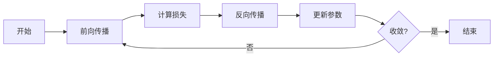
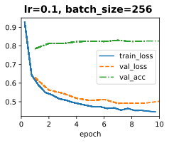
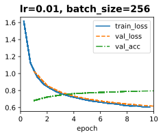
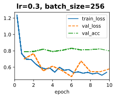
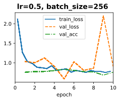
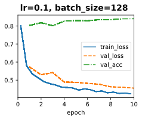
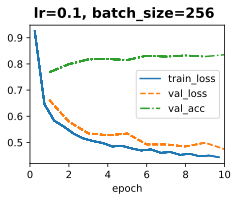
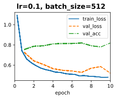

# 深度学习基础概念笔记

## 1. 张量 (Tensor)

- **定义**：张量是多维数组的泛化形式，是深度学习框架中的基本数据结构。
- **维度（阶）**：
  - 0维（标量）：单个数值，如 `5`
  - 1维（向量）：一维数组，如 `[1, 2, 3]`
  - 2维（矩阵）：二维数组，如 `[[1, 2], [3, 4]]`
  - 3维及以上：更高维数组，如彩色图像 `(高, 宽, 通道)`
- **在框架中的表示**：PyTorch 的 `torch.Tensor`，TensorFlow 的 `tf.Tensor`
- **关键属性**：形状 (shape)、数据类型 (dtype)、设备 (device)

---

## 2. 数据集 (Dataset)

- **定义**：用于训练和评估模型的数据集合。
- **组成**：由样本（输入）和标签（输出/目标）组成。
- **常见划分方式**（见下节）：训练集、验证集、测试集
- **加载方式**：
  - 小数据集：直接加载进内存
  - 大数据集：批量加载、迭代器模式
- **常用库**：PyTorch 的 `Dataset` 和 `DataLoader`，TensorFlow 的 `tf.data`

---

## 3. 训练集 / 验证集 / 测试集

| 数据集类型 | 作用 | 使用频率 | 注意点 |
| ----------- | ------ | --------- | -------- |
| **训练集 (Training Set)** | 用于模型参数学习 | 每个 epoch 多次迭代 | 数据量最大，直接影响模型拟合能力 |
| **验证集 (Validation Set)** | 调参、模型选择、早停 | 每个 epoch 或若干步后评估 | 不参与梯度更新，防止过拟合 |
| **测试集 (Test Set)** | 最终评估模型泛化能力 | 仅最终测试一次 | 严格不参与任何训练/调参过程 |

- **划分比例**（常见）：70% / 15% / 15% 或 80% / 10% / 10%，视数据量而定
- **交叉验证**：当数据量小时，可用 K 折交叉验证替代固定划分

---

## 4. 线性回归 (Linear Regression)

- **定义**：建模输入特征与连续目标值之间线性关系的模型。
- **数学表达**：
  \[
$  \hat{y} = w_1 x_1 + w_2 x_2 + \cdots + w_d x_d + b$
  \]
  向量形式：
  \[
$  \hat{y} = \mathbf{w}^\top \mathbf{x} + b$
  \]
- **损失函数**：均方误差 (MSE)
  \[$
  L = \frac{1}{n} \sum_{i=1}^{n} (\hat{y}_i - y_i)^2$
  \]
- **求解方法**：
  - 解析解（最小二乘法）：\($\mathbf{w}^* = (\mathbf{X}^\top \mathbf{X})^{-1} \mathbf{X}^\top \mathbf{y}$\)
  - 数值解：梯度下降（数据量大或不可逆时）

---

## 5. Softmax 回归

- **目的**：将线性回归推广到多分类问题。
- **数学表达**：
  \[
$  \hat{y}_k = \frac{e^{z_k}}{\sum_{j=1}^{K} e^{z_j}}, \quad z_k = \mathbf{w}_k^\top \mathbf{x} + b_k$
  \]
  其中 \($K$\) 为类别数，输出为概率分布（各分量和为 1）。
- **性质**：
  - 输出非负，总和为 1
  - 可解释为各类别的概率
- **与线性回归的关系**：线性回归输出连续值，Softmax 输出离散类别的概率分布。

---

## 6. 交叉熵 (Cross Entropy)

- **定义**：衡量两个概率分布之间差异的损失函数。
- **数学表达**（分类任务）：
  \[$
  H(p, q) = -\sum_{k=1}^{K} p_k \log q_k$
  \]
  其中 \($p$\) 为真实分布（one-hot 编码），\($q$\) 为模型预测分布（Softmax 输出）。
- **简化形式**（one-hot 标签时）：
  \[$
  L = -\log \hat{y}_{y\_true}$
  \]
- **优点**：与 Softmax 结合时梯度形式简洁，收敛快，避免 MSE 的梯度消失问题。
- **应用**：多分类任务的标准损失函数。

---

## 7. 梯度下降 (Gradient Descent)

- **核心思想**：沿损失函数梯度的反方向迭代更新参数，使损失逐步减小。
- **参数更新规则**：
  \[$
  \theta_{t+1} = \theta_t - \eta \nabla_\theta L(\theta_t)$
  \]
  其中 \($\eta$\) 为学习率。
- **三种变体**：

| 类型 | 描述 | 优点 | 缺点 |
| ------ | ------ | ------ | ------ |
| 批量梯度下降 (BGD) | 用全部数据计算梯度 | 稳定、方向准确 | 计算量大，内存需求高 |
| 随机梯度下降 (SGD) | 每个样本单独更新 | 计算快，可跳出局部最优 | 梯度噪声大，收敛不稳定 |
| 小批量梯度下降 (Mini-batch GD) | 用一个小批量数据更新 | 平衡计算效率与稳定性 | 需选择合适 batch size |

- **学习率 \($\eta$\)**：过大可能发散，过小收敛慢；常用学习率调度策略。

---

## 8. 反向传播 (Backpropagation)

- **定义**：利用链式法则高效计算损失函数对各层参数的梯度。
- **核心公式**（链式法则）：
  \[
  $\frac{\partial L}{\partial \theta} = \frac{\partial L}{\partial z} \cdot \frac{\partial z}{\partial \theta}$
  \]
- **过程**：
  1. **前向传播**：输入数据逐层计算，得到预测输出和损失
  2. **反向传播**：从输出层开始，逐层计算损失对各参数的梯度
  3. **参数更新**：使用梯度下降等优化器更新参数
- **计算图 (Computational Graph)**：现代框架自动构建计算图，实现自动微分。
- **意义**：使深层神经网络的训练在计算上可行，是深度学习的基石。

---

## 训练流程图

| 步骤 | 名称 | 做什么 |
| :---: | :--- | :--- |
| 1 | 开始 | 启动训练流程，准备数据和模型 |
| 2 | 前向传播 | 将输入数据传入模型，计算出预测值 |
| 3 | 计算损失 | 计算预测值与真实值之间的差距 |
| 4 | 反向传播 | 计算损失对每个参数的导数（梯度），知道参数该怎么调整 |
| 5 | 更新参数 | 根据梯度调整模型参数，让损失变小 |
| 6 | 收敛? | 检查模型是否已经训练好了 |
| 7 | 结束 | 训练完成，保存模型 |

## 实验结果

| 学习率大小 | Loss 表现 | Accuracy 表现 | 收敛速度 | 风险 |
| ----------- | ---------- | -------------- | --------- | ------ |
| **过大** (>0.1) | 震荡/发散 | 不稳定 | - | 无法收敛，NaN |
| **较大** (0.01~0.1) | 下降快但有波动 | 快速上升但有抖动 | 快 | 可能错过最优解 |
| **适中** (0.001~0.01) | 平稳下降 | 稳步上升 | 中等 | 低 |
| **较小** (0.0001~0.001) | 缓慢下降 | 缓慢上升 | 慢 | 易陷入局部最优 |
| **过小** (<0.0001) | 几乎不下降 | 几乎不变 | 极慢 | 欠拟合 |

| 批大小 | Loss 表现 | Accuracy 表现 | 训练速度 | 内存消耗 | 泛化能力 |
| -------- | ---------- | -------------- | --------- | --------- | --------- |
| **小** (1~32) | 噪声大，下降快 | 波动大，上升快 | 每步快，总步数多 | 低 | 较好 |
| **中** (64~256) | 平稳下降 | 平稳上升 | 平衡 | 适中 | 较好 |
| **大** (512+) | 平滑但可能较差 | 可能偏低 | 每步慢，总步数少 | 高 | 可能较差 |

## Q&A

1. **Q:** loss = nn.CrossEntropyLoss()  # 默认 reduction='mean'  
**A:** 注意后续处理loss值不要重复求平均
