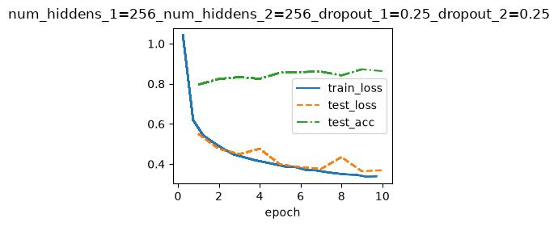
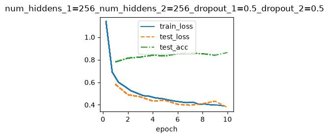
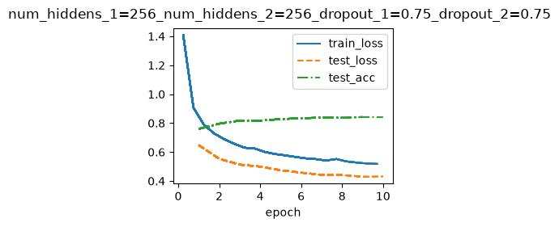
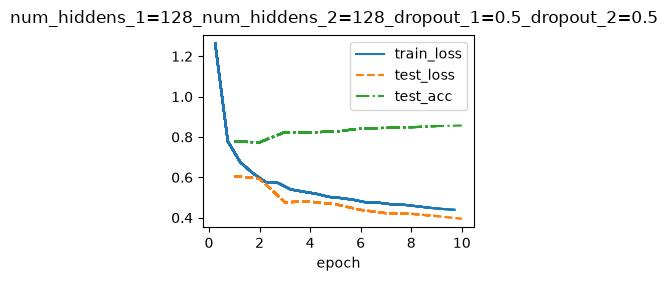
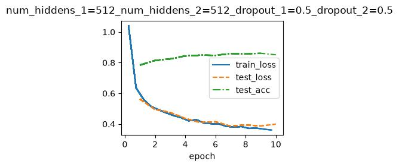

# 深度学习基础：多层感知机与正则化技巧

## 1. 多层感知机 (MLP)

### 1.1 核心概念

多层感知机是最基础的深度神经网络，由输入层、多个隐藏层和输出层构成。其核心思想是通过**非线性变换**，将线性不可分的数据映射到可分空间。

### 1.2 数学表达 (以单隐层为例)

- **线性变换**：$Z = XW_1 + b_1$
- **非线性激活**：$A = \text{ReLU}(Z)$
- **输出层**：$\hat{Y} = AW_2 + b_2$

### 1.3 关键特性

- **深度**：隐藏层的数量代表网络深度。
- **宽度**：隐藏层神经元的数量。
- **通用近似定理**：理论上，只要隐藏层神经元足够多，MLP可以近似任意连续函数。

---

## 2. 激活函数：ReLU

### 2.1 定义

修正线性单元 (Rectified Linear Unit) 的函数形式为：
$$f(x) = \max(0, x)$$

### 2.2 优势 (对比Sigmoid)

| 特性 | ReLU | Sigmoid |
| :--- | :--- | :--- |
| **梯度饱和** | 正区间无饱和，梯度恒为1 | 极易饱和，梯度趋近于0 |
| **稀疏性** | 输出负值为0，产生稀疏表征 | 输出非零，密集激活 |
| **计算效率** | 仅需比较运算，极快 | 涉及指数运算，较慢 |

### 2.3 注意事项

- **Dead ReLU问题**：当学习率过大时，部分神经元可能永久性失活（输出恒为0）。解决方案包括使用Leaky ReLU或动态调整学习率。

---

## 3. 过拟合与欠拟合

### 3.1 定义对比

| 状态 | 训练误差 | 泛化误差 (测试误差) | 根本原因 |
| :--- | :--- | :--- | :--- |
| **欠拟合** | 较高 | 同样较高 | 模型容量不足，未能捕捉数据模式 |
| **过拟合** | 极低 | 较高 | 模型容量过大，记忆了噪声而非规律 |

### 3.2 诊断方法

- **学习曲线**：观察训练集与验证集上的Loss曲线。
  - 两者均高 → 欠拟合。
  - 训练极低，验证高 → 过拟合（两者差距过大）。

---

## 4. 正则化技术

### 4.1 权重衰减 (L2正则化)

- **原理**：在损失函数中加入权重的平方和惩罚项。
  $$Loss = Loss_{original} + \frac{\lambda}{2} ||W||^2$$
- **作用**：限制权重的大小，使模型更加平滑，降低对局部噪声的敏感度。
- **效果**：权重值被“衰减”至接近零，但不完全为零。

### 4.2 Dropout

- **原理**：在训练过程中，以概率 $p$ 随机“丢弃”部分神经元（将其输出置零）。
- **关键机制**：
  - **训练时**：按概率 $p$ 丢弃，并保持输出缩放（Inverted Dropout）。
  - **测试时**：使用全部神经元，不进行丢弃。
- **作用**：迫使网络学习更鲁棒的特征，防止神经元之间产生复杂的共适应关系，相当于集成了大量子网络。

---

## 5. 学习率调节

### 5.1 学习率对训练的影响

| 场景 | 表现 |
| :--- | :--- |
| **过大** | Loss震荡甚至发散，无法收敛。 |
| **过小** | 收敛速度极慢，极易陷入局部极小值。 |
| **适中** | Loss平稳下降，在最低点附近微调。 |

### 5.2 常用调节策略

#### 阶梯式下降 (Step Decay)

每隔固定轮次，将学习率乘以一个衰减因子（如每次衰减为原来的0.1倍）。

#### 指数衰减 (Exponential Decay)

$lr = lr_0 \cdot e^{-kt}$，平滑连续地降低学习率。

#### 余弦退火 (Cosine Annealing)

学习率按照余弦函数周期变化，常用于帮助模型跳出鞍点。

#### 自适应优化器 (Adam, RMSprop)

- 核心思想：为每个参数独立维护学习率，根据梯度的一阶矩和二阶矩动态调整。
- **优势**：对初始学习率不敏感，适合非平稳目标。

---

## 6. 技巧总结：如何应对问题

1. **欠拟合**
    1. 增加模型复杂度（层数/神经元）。
    2. 减少正则化强度（降低 $\lambda$ 或 Dropout 概率）。
    3. 检查特征工程是否充分。
2. **过拟合**
    1. 增加数据量（扩增）。
    2. 引入 Dropout（通常设为 0.3 ~ 0.5）。
    3. 增大权重衰减系数 $\lambda$。
    4. 早停法 (Early Stopping)。
3. **收敛缓慢**
    1. 尝试使用Adam等自适应优化器。
    2. 使用学习率预热 (Warm-up) 再衰减。
    3. 检查数据是否归一化。
4. **Loss震荡**
    1. **降低**学习率。
    2. 增加Batch Size（使梯度估计更稳定）。

## 实验结果

| 影响维度 | 说明 | 建议 / 典型取值 |
| :--- | :--- | :--- |
| 核心作用 | 训练时随机丢弃神经元，防止过拟合 | 测试时关闭（`model.eval()`） |
| 丢弃概率 p 过小 | 丢弃太多，模型学习能力不足 → 欠拟合 | 避免 < 0.1 |
| 丢弃概率 p 过大 | 丢弃太少，正则化效果弱 → 仍易过拟合 | 避免 > 0.7 |
| 输入层 | 丢弃概率宜较小，避免丢失重要输入特征 | 推荐 0.1 ~ 0.2 |
| 隐藏层 | 可适当增大丢弃概率 | 推荐 0.2 ~ 0.5 |
| 训练收敛速度 | 使用 Dropout 后收敛变慢，需增加迭代次数 | 适当增加 epoch 或学习率 |
| 泛化能力 | 合理使用可显著提升验证集 / 测试集准确率 | 对中小数据集效果明显 |
| 神经元共适应 | 减少神经元之间的依赖，增强特征独立性 | 提升模型鲁棒性 |
| 卷积层使用 | 通常使用 `Dropout2d`（按通道丢弃）或较少使用 | BN 可部分替代 Dropout |
| 循环层使用 | 需使用变种如 Variational Dropout | 普通 Dropout 不适用 |
| 测试阶段 | 必须关闭 Dropout，使用全部神经元 | PyTorch: `model.eval()` |

| 影响维度 | 说明 | 建议 / 典型取值 |
| :--- | :--- | :--- |
| 核心作用 | 决定网络容量与特征抽象能力 | 需与数据量匹配 |
| 层数过少（1~2 层） | 表达能力不足，可能欠拟合 | 适合线性 / 简单非线性问题 |
| 层数适中（3~5 层） | 多数任务的平衡点，训练较稳定 | 推荐作为起点 |
| 层数过多（>5 层） | 容量大，但训练难度和过拟合风险上升 | 需配合 BN / 残差 / 正则化 |
| 表达能力 | 层数 ↑ → 可拟合更复杂函数 | 但受限于数据量 |
| 梯度问题 | 层数 ↑ → 梯度消失 / 爆炸风险 ↑ | 需用残差连接、合理初始化 |
| 参数量 | 层数线性增加参数量（宽度固定时） | 显存和训练时间 ↑ |
| 训练难度 | 深层网络优化更困难 | 建议使用 BatchNorm、残差块 |
| 泛化性能 | 数据量小 → 浅层更安全；数据量大 → 可尝试深层 | 监控训练 / 验证误差差 |
| 实际调参策略 | 从浅层开始逐步加深，验证集不涨则停止 | 避免盲目增加层数 |
