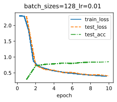
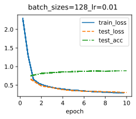
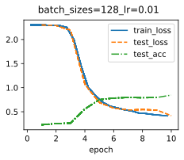
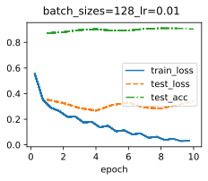

# 深度学习视觉核心知识点笔记：从AlexNet到微调

## 1. AlexNet (2012)

**深度学习的开山之作**，在ImageNet 2012竞赛中以巨大优势夺冠，拉开了深度学习时代的序幕。

- **核心贡献**：
  - **ReLU激活函数**：引入`ReLU`代替`Sigmoid`，有效缓解了梯度消失问题，加速了训练收敛（快数倍）。
  - **Dropout正则化**：在全连接层使用Dropout随机丢弃神经元，显著缓解过拟合。
  - **数据增强**：使用了裁剪、翻转等方法，极大扩充了训练数据集。
  - **GPU并行**：利用双GPU训练，处理大规模数据。
- **网络结构特点**：
  - 包含5个卷积层 + 3个全连接层（深度为8层）。
  - 使用了**局部响应归一化（LRN）**（后被证明效果有限，后续网络较少使用）。
  - 使用重叠的最大池化（步长 < 核大小）。



---

## 2. VGGNet (2014)

**强调深度与简洁性**，证明了增加网络深度可以提升性能。

- **核心思想**：
  - **小卷积核**：统一使用 **3x3** 卷积核，步长=1，填充=1。
  - **小池化核**：统一使用 **2x2** 最大池化，步长=2。
- **优势**：
  - 两个3x3卷积堆叠等效于一个5x5的感受野，三个等效于7x7，但参数量更少，且非线性变换更多（决策能力更强）。
- **缺点**：
  - 参数总量巨大（尤其是全连接层），训练极慢，容易过拟合，占用显存极高（VGG-16约138M参数）。

---

## 3. GoogLeNet / Inception (2014)

**横向拓宽网络**，在增加深度的同时控制计算量。

- **核心思想：Inception模块**
  - 在同一层中并行使用 **1x1，3x3，5x5** 卷积核和 **3x3最大池化**，最后将输出在通道维度上拼接（Concatenate）。
  - 这样网络可以**自主选择**适合的卷积核大小。
- **关键技巧：1x1卷积（瓶颈层）**
  - 在3x3和5x5卷积之前加入1x1卷积，用于**降维**（减少通道数），大幅减少计算量。
- **辅助分类器**：
  - 在中间层添加两个辅助Softmax分支（推理时去掉），用于缓解梯度消失，提供正则化作用。

---

## 4. ResNet (残差网络, 2015)

**解决退化问题**，首次将网络深度推到上百层甚至上千层（ResNet-152）。

- **核心思想：残差连接（跳跃连接）**
  - 让网络拟合 **残差映射** $F(x) = H(x) - x$ 而不是直接拟合底层映射 $H(x)$。
- **公式**：
  - 输出： $y = F(x, \{W_i\}) + x$
  - 输入 $x$ 通过快捷连接直接跨层传递，与卷积输出相加。
- **为什么有效？**
  - **解决梯度消失**：梯度可以直接通过捷径回流到浅层，保证了极深网络的训练。
  - **恒等映射**：当 $F(x)=0$ 时，实现恒等映射，网络不会因为变深而变差（至少不会退化）。
- **结构变体**：**Bottleneck（瓶颈结构）**（1x1降维 -> 3x3卷积 -> 1x1升维），用于ResNet-50/101等深层网络以节省算力。

---

## 5. Batch Normalization (BN, 批归一化)

**深度学习训练中的“标配”**，通常位于卷积层/全连接层之后，激活函数之前。

- **核心操作**：
  - 对每个Batch的数据进行归一化：使其均值为0，方差为1。
  - 引入可学习的 **缩放参数 $\gamma$** 和 **平移参数 $\beta$**，恢复网络表达能力。
- **公式**：
    $$ \mu_B = \frac{1}{m}\sum_{i=1}^m x_i $$
    $$ \sigma_B^2 = \frac{1}{m}\sum_{i=1}^m (x_i - \mu_B)^2 $$
    $$ \hat{x}_i = \frac{x_i - \mu_B}{\sqrt{\sigma_B^2 + \epsilon}} $$
    $$ y_i = \gamma \hat{x}_i + \beta $$
- **优点**：
    1. 允许使用更大的学习率，加速收敛（防止梯度爆炸/消失）。
    2. 具有轻微的正则化效果（因为Batch的均值方差有噪声），可减少对Dropout的依赖。
    3. 使得网络对参数的初始化不那么敏感。

---

## 6. 残差连接 (Residual Connection) 在Transformer中的应用

虽然概念源于ResNet，但在NLP（如Transformer）和CV（如ViT）中广泛使用。

- **在Transformer中的形式**：
  - `输出 = LayerNorm( X + Sublayer(X) )`
  - 即：**残差连接** 接 **层归一化**。
- **作用**：
    1. 保证深层Transformer（如BERT-large，24层）训练的稳定性。
    2. 让信息有“高速公路”直接前传，缓解深层网络的表示瓶颈。

---

## 7. 预训练模型 (Pre-trained Model) & 微调 (Fine-tuning)

**迁移学习的核心范式**，极大降低了训练大模型的成本。

### 7.1 预训练模型

- **定义**：在**大型通用数据集**（如ImageNet-1K, COCO）上预先训练好的模型权重。
- **本质**：模型已经学习到了通用的底层特征（边缘、纹理、形状）和部分语义特征。
- **常见来源**：PyTorch官方库（`torchvision.models`）、HuggingFace（Transformers）、OpenAI（CLIP）等。

### 7.2 微调 (Fine-tuning)

- **定义**：在预训练模型的基础上，使用**特定任务的小数据集**进行二次训练。
- **策略**：
    1. **特征提取器（冻结）**：冻结骨干网络（Backbone）所有层，只训练新添加的全连接分类层（线性探测）。
    2. **标准微调（全量）**：使用较小的学习率（例如 $1e^{-4}$ 或 $1e^{-5}$）更新所有参数。
    3. **渐进式解冻**：先训练顶层（语义层），再逐步解冻底层（细节层）。
- **注意点**：
  - 新分类头的维度必须匹配下游任务的类别数。
  - 若下游数据量极少，建议使用更小的学习率，防止灾难性遗忘（Catastrophic Forgetting）。

---

## 总结对比

| 模型 | 核心创新 | 深度 | 特点 |
| :--- | :--- | :--- | :--- |
| **AlexNet** | ReLU + Dropout | 8层 | 开启深度学习时代 |
| **VGG** | 小卷积核堆叠 | 16-19层 | 结构规整，但极耗显存 |
| **GoogLeNet** | Inception模块 | 22层 | 宽度网络，计算高效 |
| **ResNet** | **残差连接** | 50-152层 | 解决梯度消失，允许极深 |
| **BN** | **批量归一化** | - | 加速收敛，稳定训练（常与上述网络结合使用） |
| **微调** | **预训练+迁移** | - | 当前工业界落地主流方案 |

## 经典CNN架构横向对比表

| **维度** | **AlexNet (2012)** | **VGGNet (2014)** | **GoogLeNet (Inception v1, 2014)** | **ResNet (2015)** |
| :--- | :--- | :--- | :--- | :--- |
| **设计理念** | 深且宽，用GPU算力堆叠 | **深度优先**，用重复简单结构堆叠极深网络 | **宽度优先**，多尺度卷积核并行提取特征 | **残差学习**，解决退化问题，使网络可超深 |
| **核心组件** | ReLU + Dropout + LRN | 3x3卷积堆叠 + 2x2池化 | **Inception模块** + 1x1降维 + 辅助分类器 | **残差块（Skip Connection）** + Bottleneck |
| **卷积核策略** | 11x11, 5x5, 3x3混用 | **仅3x3**（感受野堆叠等效） | 1x1, 3x3, 5x5并行拼接 | 3x3（主流），深层次用Bottleneck（1x1-3x3-1x1） |
| **池化方式** | 重叠最大池化（步长<核大小） | 2x2最大池化（步长2） | 3x3最大池化（步长2） | 2x2最大池化（步长2），残差块内极少池化 |
| **归一化方式** | 局部响应归一化（LRN） | 通常配合**BatchNorm**（VGG后改良版本） | 使用BN（Inception v2起标配） | **标配BN**（放在卷积后、激活前） |
| **参数量** | ~**60M** | **~138M** (VGG-16) / 144M (VGG-19) | **~6.8M** (v1) | **~25.6M** (ResNet-50) / **~60M** (ResNet-152) |
| **计算量 (FLOPs)**| ~0.7 GFLOPs | ~15.5 GFLOPs (VGG-16) | ~1.5 GFLOPs | ~3.8 GFLOPs (ResNet-50) |
| **深度 (层数)** | 8层 (5 Conv + 3 FC) | 16 ~ 19层 | 22层 (含Inception子层) | **50 / 101 / 152** 层（甚至1000+） |
| **主要优势** | 开创性引入ReLU/Dropout | 结构极其规整，感受野可控 | **极低参数量**，计算高效 | 梯度通畅，支持超深网络，准确率最高 |
| **主要劣势** | 依赖LRN（后续被弃用） | **极其耗显存/慢**，全连接层冗余 | 模块设计复杂，手工调参较多 | 深层Bottleneck存在信息瓶颈（少量） |
| **全连接层** | 3个（大参量） | 3个（**参量占90%以上**） | **1个**（使用全局平均池化替代） | **1个**（全局平均池化 + FC） |
| **辅助损失** | 无 | 无 | **有**（两个辅助分类器） | 无（但有时在极深层用） |
| **典型应用场景** | 经典学术对照实验 | 特征提取器（FC替换为FPN） | 移动端/低算力部署 | **工业界最常用Backbone**（检测/分割） |

---

## 补充：关键指标横向解读

### 1. 参数量与速度的权衡

- **GoogLeNet** 用 **1x1卷积降维** 将参数量压至VGG的1/20，但精度更高，是早期“轻量化”的代表。
- **VGG** 虽然参数量最大，但其**感受野计算简单**（3x3堆叠）使其在风格迁移等需要感受野控制的领域仍有用武之地。

### 2. BatchNorm (BN) 的介入时间

- AlexNet和VGG原始论文没有BN（当时未提出）。
- 现代实现中（如PyTorch的`vgg16_bn`），**VGG和ResNet均已标配BN**，这使得它们可以使用更大学习率，且对Dropout的依赖降低（ResNet几乎不用Dropout）。

### 3. 残差连接（Skip Connection）的降维影响

- ResNet的残差连接要求输入和输出的维度必须匹配。当维度不匹配时（如通道数翻倍），需要通过 **1x1卷积** 或 **补零（Padding）** 来匹配维度，这也是ResNet参数量增多的原因之一。

### 4. 预训练与微调的“通用性”排序（基于ImageNet-1K）

- **ResNet系列** > **VGG系列** > **GoogLeNet系列** > **AlexNet**。
- 目前工业界（2026年）**ResNet-50 / ResNet-101** 依然是最常用的骨干网预训练权重提供者，远超VGG。

---

## 各模型最终数据

```text
============================================================
                          AlexNet                           
============================================================
指标                                                值
------------------------------------------------------------
Train Loss                                   0.3987
Train Accuracy                               0.8523
Test Loss                                    0.4038
Test Accuracy                                0.8502
============================================================
```

```text
============================================================
                            VGG                             
============================================================
指标                                                值
------------------------------------------------------------
Train Loss                                   0.2950
Train Accuracy                               0.8923
Test Loss                                    0.3038
Test Accuracy                                0.8880
============================================================
```

```text
============================================================
                         GoogleNet                          
============================================================

指标                                                值
------------------------------------------------------------

Train Loss                                   0.4193
Train Accuracy                               0.8429
Test Loss                                    0.4182
Test Accuracy                                0.8468
============================================================
```

```text
============================================================
                           ResNet                           
============================================================

指标                                                值
------------------------------------------------------------

Train Loss                                   0.0299
Train Accuracy                               0.9913
Test Loss                                    0.3424
Test Accuracy                                0.9037
============================================================
```

## Q&A

1. **Q:** 模型训练过程中loss无变化，没有训练效果  
**A:** 模型网络中部分内容是延后初始化的，需要在主程序入口处再次初始化  

```text
def apply_init(self, inputs, init=None):
    """延后初始化"""
    if init is not None:
        # 先做一次前向传播来初始化 Lazy 层
        with torch.no_grad():
            self.forward(*inputs)
        # 然后应用初始化
        self.net.apply(init)
```
